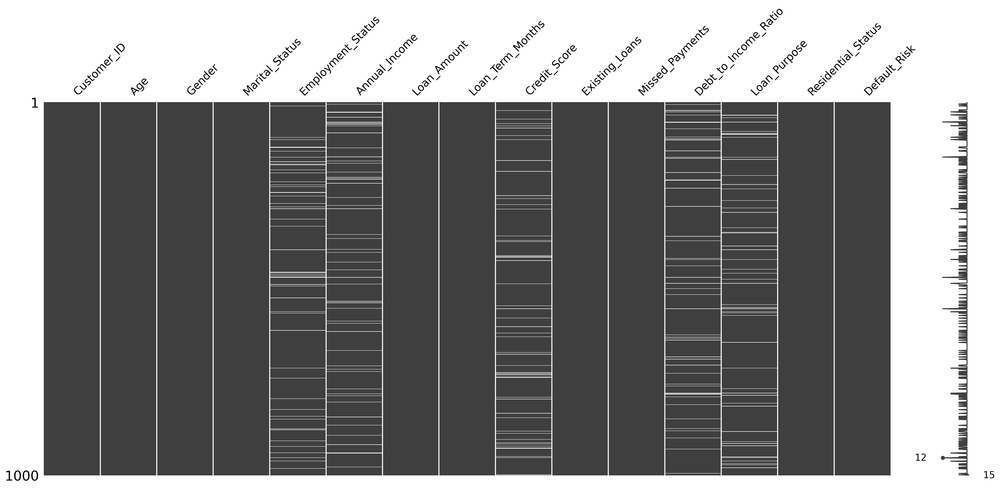
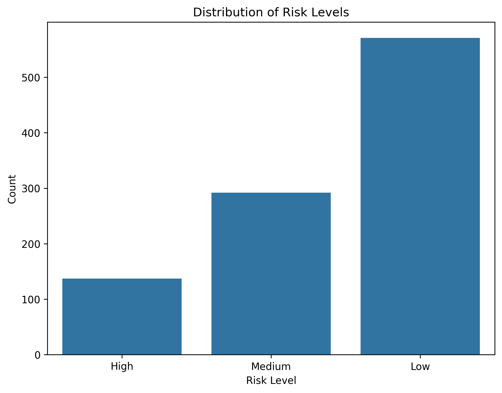
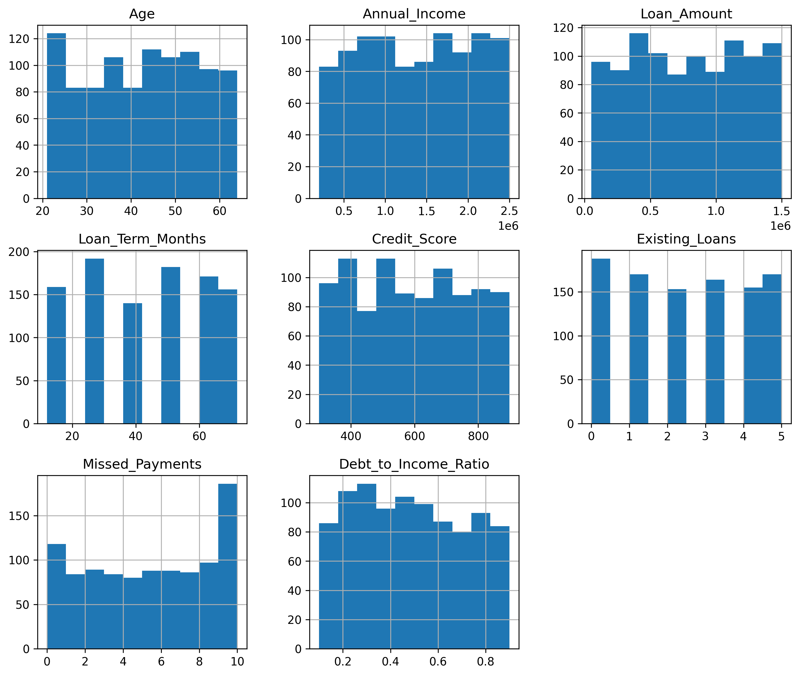
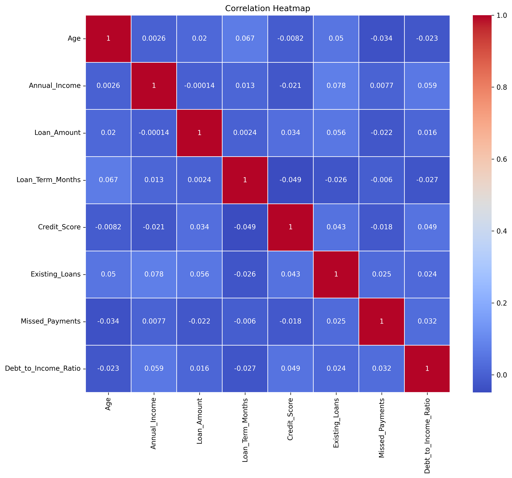
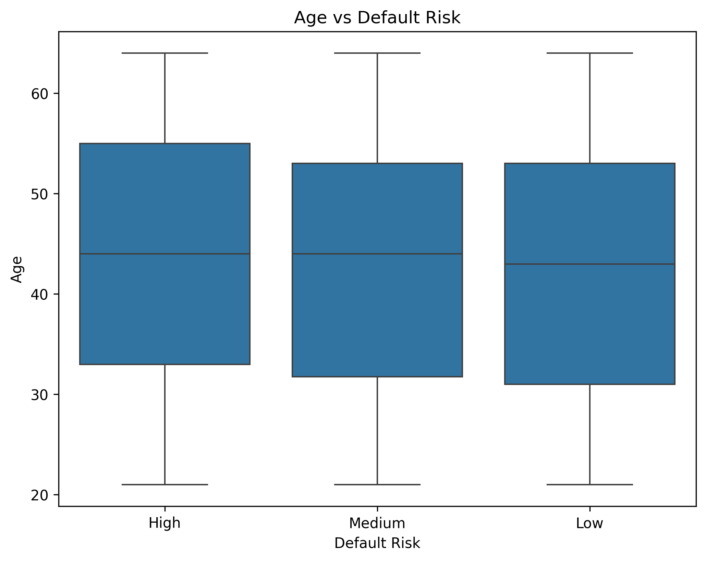
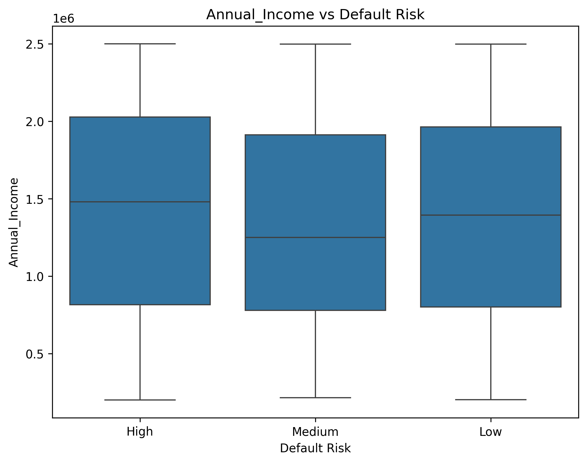
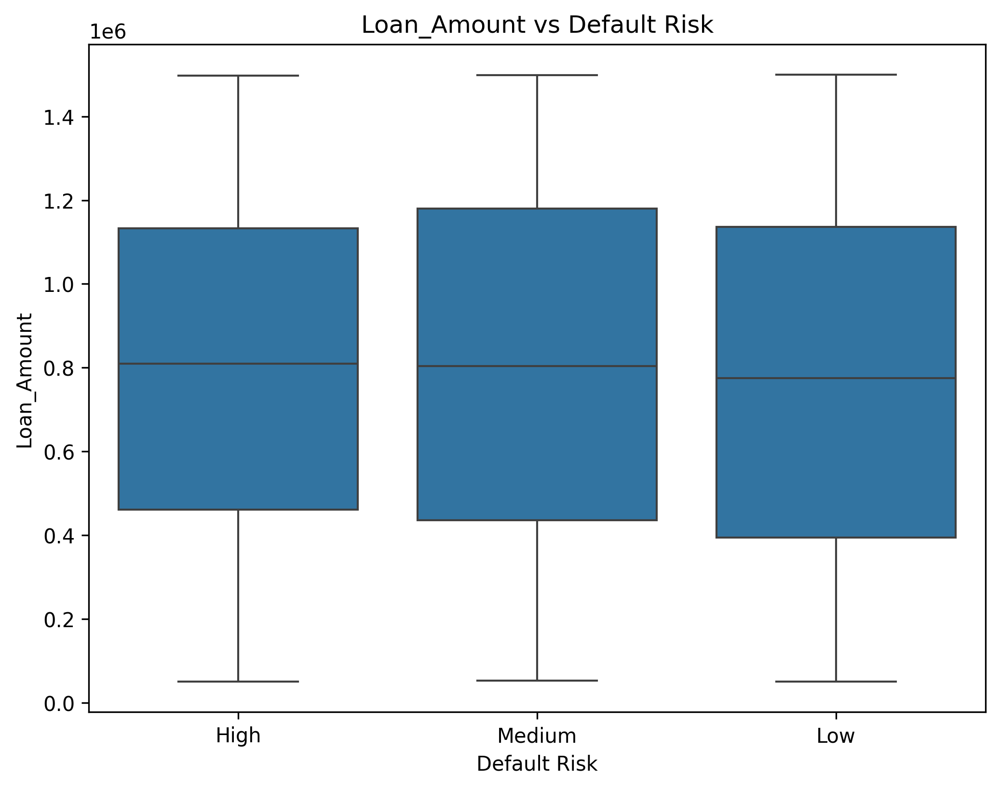
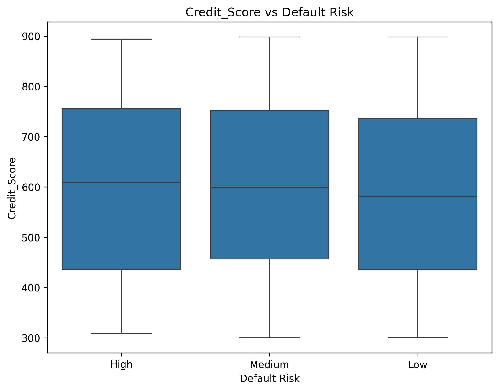
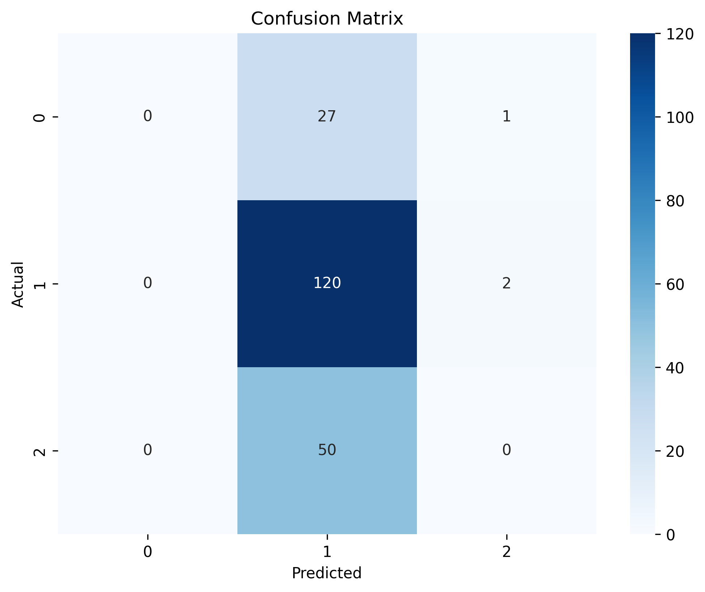

# Credit Risk Analysis & Prediction using Machine Learning

## Project Overview

This project focuses on analyzing customer financial data and building a Machine Learning model to classify customers into different credit risk categories:

- Low Risk
- Medium Risk
- High Risk

The project includes:
- Exploratory Data Analysis (EDA)
- Missing Value Analysis
- Data Visualization
- Feature Engineering & Preprocessing
- Machine Learning Classification
- Model Evaluation using Confusion Matrix & Accuracy Metrics

The goal is to simulate a real-world banking/financial risk assessment system used to evaluate loan applicants.

---

# Dataset Information

The dataset contains customer-level financial and demographic details such as:

| Feature | Description |
|---|---|
| Age | Customer age |
| Gender | Gender of customer |
| Marital_Status | Marital status |
| Employment_Status | Employment type |
| Annual_Income | Annual income |
| Loan_Amount | Loan amount requested |
| Loan_Term_Months | Loan repayment duration |
| Credit_Score | Creditworthiness score |
| Existing_Loans | Number of active loans |
| Missed_Payments | Historical missed payments |
| Debt_to_Income_Ratio | Debt burden ratio |
| Loan_Purpose | Purpose of loan |
| Residential_Status | Housing status |
| Default_Risk | Target Variable |

The dataset intentionally contains missing values to simulate real-world financial datasets.

---

# Technologies Used

- Python
- Pandas
- NumPy
- Matplotlib
- Seaborn
- Missingno
- Scikit-learn

---

# Exploratory Data Analysis (EDA)

Performed extensive EDA to understand:
- Distribution of risk categories
- Feature distributions
- Missing data patterns
- Correlation between financial variables
- Relationship between customer attributes and default risk

---

# Missing Value Analysis

Visualized missing values to identify incomplete financial records and understand missing data patterns.



---

# Distribution of Risk Levels

Analyzed the distribution of customers across different risk categories.



---

# Distribution of Numerical Variables

Visualized the distribution of numerical features to understand skewness, spread, and outliers.



---

# Correlation Heatmap

Generated a correlation heatmap to analyze relationships among financial variables.



---

# Risk vs Financial Features

## Age vs Default Risk



---

## Annual Income vs Default Risk



---

## Loan Amount vs Default Risk



---

## Credit Score vs Default Risk



---

# Data Preprocessing

Implemented preprocessing pipelines using Scikit-learn.

## Numerical Features
- Median Imputation
- Standard Scaling

## Categorical Features
- Most Frequent Imputation
- One-Hot Encoding

## Target Variable Encoding

Encoded risk categories using Label Encoding:

| Risk Category | Encoded Value |
|---|---|
| High | 0 |
| Medium | 1 |
| Low | 2 |

---

# Machine Learning Model

## Model Used
- Random Forest Classifier

## Why Random Forest?
- Handles mixed data types effectively
- Robust against overfitting
- Strong performance on structured/tabular datasets
- Provides feature importance insights

---

# Model Evaluation

The model was evaluated using:
- Accuracy Score
- Classification Report
- Confusion Matrix

---

# Confusion Matrix

Visualized model predictions against actual values to evaluate classification performance.



---

# Key Insights

- The dataset is imbalanced with significantly more Low-risk customers.
- Credit score and missed payments showed noticeable influence on risk categorization.
- Missing value analysis revealed realistic incomplete financial records.
- Correlation between features was generally low, reducing multicollinearity concerns.

---

# Project Structure

```bash
├── credit_risk_analysis_dataset.csv
├── Data_Analysis.py
├── missing_values_matrix.png
├── correlation_heatmap.png
├── confusion_matrix.png
├── risk_level_distribution.png
├── variable_distribution.png
├── Age_vs_default_risk.png
├── Annual_Income_vs_default_risk.png
├── Loan_Amount_vs_default_risk.png
├── Credit_Score_vs_default_risk.png
└── README.md
```

---

# Future Improvements

- ROC-AUC Curve Analysis
- Hyperparameter Tuning
- Cross Validation
- XGBoost & LightGBM Implementation
- Feature Importance Visualization
- Handling Class Imbalance using SMOTE
- Deployment using Streamlit/Flask

---

# Learning Outcomes

Through this project, I learned:
- Real-world data preprocessing
- Exploratory Data Analysis (EDA)
- Missing value handling techniques
- Building ML pipelines
- Classification modeling
- Model evaluation techniques
- Financial risk analytics concepts

---

# Author

Maaz Khan

Data Analytics & Machine Learning Enthusiast
